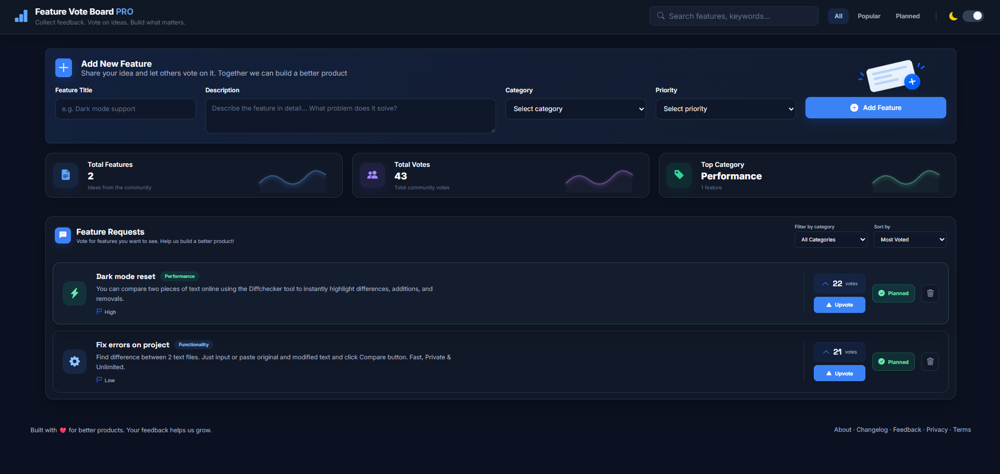

<div align="center">

# 🚀 Feature Vote Board PRO

A modern feature voting board for collecting ideas, voting on feature requests and tracking planned improvements.

Built with **HTML, CSS and Vanilla JavaScript**.


### 🌐 Live Demo

[View Live Project]()

</div>

---

## 📸 Preview



---

## ✨ Features

- ➕ Add new feature requests
- 📝 Feature title and description
- 🏷️ Multiple feature categories
- 🚩 Priority selection
- 👍 Upvote feature requests
- 📅 Mark features as planned
- 🔥 Popular feature filtering
- 🔎 Real-time feature search
- 🗂️ Filter by category
- ↕️ Sort by most voted, newest or oldest
- 📊 Dynamic statistics
- 🏆 Automatic top category detection
- 🌙 Light / Dark mode
- 💾 Local Storage persistence
- 📱 Fully responsive design
- 🗑️ Delete feature requests

---

## 🛠️ Technologies

- **HTML5**
- **CSS3**
- **Vanilla JavaScript**
- **Local Storage**
- **Bootstrap Icons**
- **Google Fonts**

---

## ⚙️ How It Works

Feature requests are stored inside a JavaScript state array.

Each feature contains information such as:

```js
{
  id: Date.now(),
  title,
  description,
  category,
  priority,
  votes: 0,
  planned: false
}
```

The application follows a simple state-driven workflow:

```text
USER ACTION
    ↓
UPDATE STATE
    ↓
SAVE DATA
    ↓
RENDER FEATURES
    ↓
UPDATE UI
```

Search, filtering and sorting are handled before features are rendered:

```text
features
   ↓
filterFeatures()
   ↓
searchFeatures()
   ↓
sortFeatures()
   ↓
renderFeatures()
```

Data is saved in `localStorage`, so feature requests remain available after refreshing or reopening the page.

---

## 📊 Statistics

The dashboard automatically calculates:

- Total number of features
- Total number of votes
- Most used feature category
- Number of features inside the top category

Category statistics are generated dynamically from the current application state.

---

## 🌙 Theme System

The application includes persistent light and dark themes.

The selected theme is stored in `localStorage` and restored automatically when the application loads.

---

## 📱 Responsive Design

Feature Vote Board PRO is optimized for:

- Desktop
- Laptop
- Tablet
- Mobile
- Small mobile screens

The layout automatically adapts forms, statistics, feature cards, navigation and controls for smaller devices.

---

## 📂 Project Structure

```text
feature-vote-board-pro/
│
├── images/
│   ├── feature-image.png
│   └── preview.png
│
├── index.html
├── style.css
├── script.js
├── LICENSE
└── README.md
```

---

## 💻 Run Locally

Clone the repository:

```bash
git clone https://github.com/JohnYisBackk/feature-vote-board-pro.git
```

Open the project folder:

```bash
cd feature-vote-board-pro
```

Then open:

```text
index.html
```

in your browser.

No installation or dependencies are required.

---

## 🧠 What I Learned

This project helped me practice:

- Managing application state
- Saving and loading data with `localStorage`
- Creating dynamic DOM elements
- Rendering UI from JavaScript data
- Working with array methods such as `find()`, `filter()`, `reduce()` and `forEach()`
- Searching data with `includes()`
- Sorting arrays
- Dynamic object properties
- Working with `Object.entries()`
- Event delegation
- Dataset attributes
- Boolean state toggling
- Building reusable helper functions
- Separating data logic from rendering logic
- Creating persistent light and dark themes
- Building responsive layouts

---

## 👨‍💻 Author

**Samuel Jahn**

🌐 Portfolio:  
https://samueljahn.sk

💻 GitHub:  
https://github.com/JohnYisBackk

---

## 📄 License

This project is licensed under the MIT License.

Copyright © 2026 Samuel Jahn

</div>
